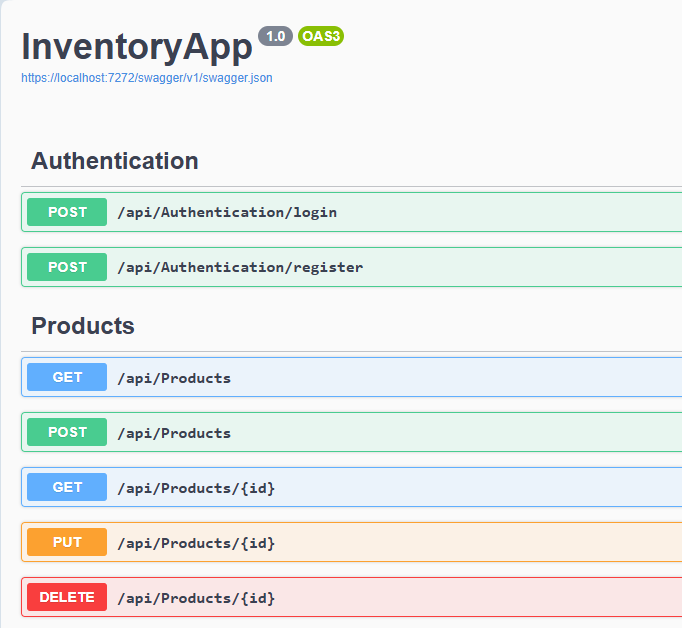
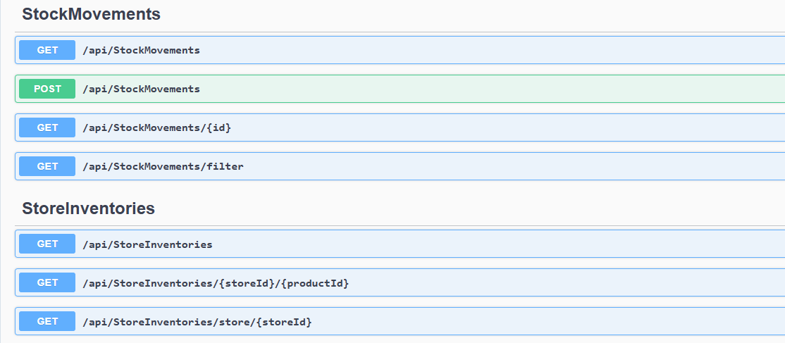
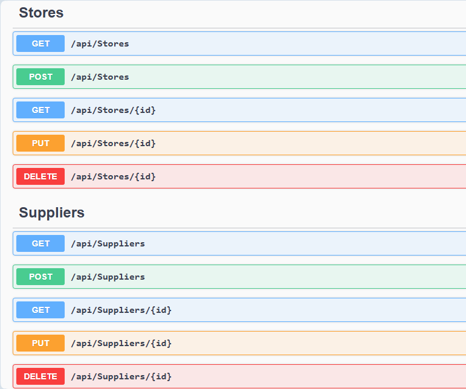

# InventoryApp

---

## 📌 Design Decisions

- **Layered Architecture**  
  The solution follows a clear layered structure for scalability and maintainability:
  - **Controllers**: Thin, focused on HTTP handling and role-based access, delegating logic to services.
  - **Services**: Encapsulate business logic following the "thick service, thin controller" principle.
  - **Interfaces**: Ensure loose coupling, testability, and flexibility (e.g., swapping caching strategies).
  - **DTOs**: Explicitly define input/output shapes to prevent over-posting and maintain separation from domain models.
  - **Data Layer**: Uses **Entity Framework Core** with a **Code-First** approach for schema management and clean database interactions.

- **Dependency Injection (DI)**  
  ASP.NET Core's DI container enables decoupling of services, DbContext, caching, and logging components, ensuring modularity, testability, and flexibility.

- **Caching**  
  **IMemoryCache** is used to cache frequently accessed data (e.g., product and supplier lists), reducing database load and enhancing response times.

- **Audit Logging**  
  All state-changing operations (Add, Update, Delete) trigger audit log entries, supporting traceability and compliance with metadata.

- **Soft Deletion**  
  Entities are soft-deleted with an `IsDeleted` flag, preserving data integrity, historical traceability, and foreign key references.

- **Inventory via StockMovement Table**  
  Stock quantity is managed through the **StockMovement** table, ensuring:
  - Immutable audit trail for inventory changes
  - Real-time stock level accuracy
  - Decoupling product data from inventory flow, enhancing data integrity and business resilience.

- **Role-Based Authorization**  
  Role-based access control using `[Authorize(Roles = "...")]`:
  - **CentralAdmin**: Full CRUD access
  - **StoreAdmin**: Scoped access, limited to their own store’s data.

- **Rate Limiting**  
  Separate rate-limiting policies for:
  - `ReadPolicy`: Frequent GETs
  - `WritePolicy`: Control over POST/PUT/DELETE actions.

- **Scalability & Best Practices**  
  - Decoupled business logic.
  - Interfaces for easy testing, replacement, and scalability.
  - Thin controllers, ensuring maintainability.
  - EF Core code-first approach for database consistency with domain models.

## ✅ Assumptions

- Each **Product** must be associated with a valid **Supplier** (`SupplierId` is required when adding a product).
- Only **CentralAdmin** users are allowed to perform global write operations (Add, Update, Delete across all stores).
- **StoreAdmins** can perform operations within the scope of their **own stores**, but do not have access to global or cross-store data.
- Deleted entities are retained in the database via **soft deletion** (`IsDeleted = true`) to maintain data integrity and audit history.
- All API consumers are expected to authenticate using a **JWT-based** token system with embedded role claims.
- **Audit logging** is mandatory for all state-changing operations to support traceability.

---

## 🖥️ API Design

- **Swagger UI**  
  The API includes **Swagger UI** for auto-generated, interactive documentation. It simplifies exploration and testing of endpoints, improving the developer experience and reducing onboarding time.
  
  
  

---

## 🔄 Evolution Rationale (v1 → v3)

This system evolved in **deliberate, scalable steps** — not by just adding features, but by making **architectural decisions aligned with growth**, real-world use cases, and business goals.

---

### ✅ **V1 – Foundation for One Store**

**Why it started this way:**  
Began with a simple CLI/API setup to **validate the core domain model**: how stock flows in/out and how to track it over time.

**Key Design Reasoning:**
- Stock wasn’t stored directly in the product — I opted to compute it from a separate `StockMovement` log to **ensure auditability from Day 1**.
- Used local storage to allow fast prototyping without infra overhead.
- Kept the system minimal to focus on **correctness, not complexity**.

---

### ✅ V2 Rationale – Scaling to Multi-Store Operations

- Introduced a **`Store`** model to represent each branch individually, enabling store-specific operations.
- Designed a **`StoreInventory`** table to track **stock per store**, decoupling quantity from the `StockMovement` model:
  - Supports independent inventory across branches
  - Uses `[JsonIgnore]` for cleaner API responses
- Migrated to **SQL Server** for relational integrity, better indexing, and optimized query performance.
- Replaced local CLI with a **REST API**, exposing endpoints for frontend use and third-party integration.
- Added **JWT-based authentication** and **role-based authorization** to enforce secure, scoped access:
  - `CentralAdmin`: Full system access
  - `StoreAdmin`: Access limited to own store data
- Applied **request throttling** with read/write policies to control traffic and protect endpoints under increased load:
  - `ReadPolicy` allows higher GET frequency
  - `WritePolicy` protects against excessive POST/PUT/DELETE

---

### ✅ V3 Rationale – Scaling to Thousands of Stores & Concurrent Ops

- Adopted a **"thin controller, thick service"** architecture:
  - All business logic resides in service classes (e.g., `ProductsService`, `StockService`), improving testability and maintainability.
  - Controllers only handle HTTP concerns and delegate to services.

- Introduced **interfaces** (e.g., `IProductsService`, `ISuppliersService`) to enforce separation of concerns and support:
  - Loose coupling
  - Easier unit testing and mocking
  - Plug-and-play flexibility for future upgrades (e.g., switching cache/database)

- Implemented **DTOs (Data Transfer Objects)** for all API requests and responses:
  - Avoids over-posting
  - Decouples external contracts from internal models
  - Supports versioning and evolution without breaking clients

- Designed a robust **Audit Logging** mechanism for all state-changing operations:
  - Automatically captures user identity, action type, timestamp, and entity affected
  - Stored persistently for full traceability and compliance

- Added **caching** with `IMemoryCache` to reduce read pressure on the database for frequent queries (e.g., product list, supplier list)

- Applied **rate-limiting** policies to ensure system stability under high load:
  - `ReadPolicy` allows higher GET frequency
  - `WritePolicy` protects against excessive POST/PUT/DELETE

